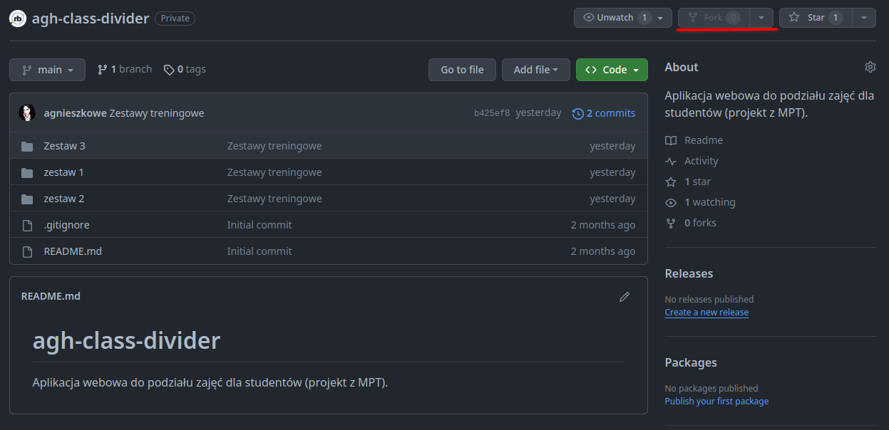
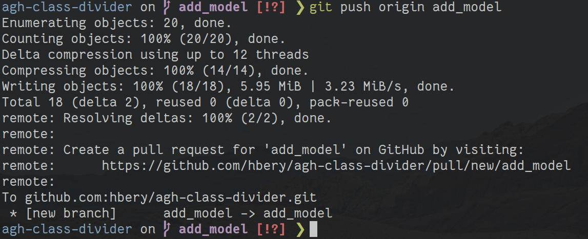
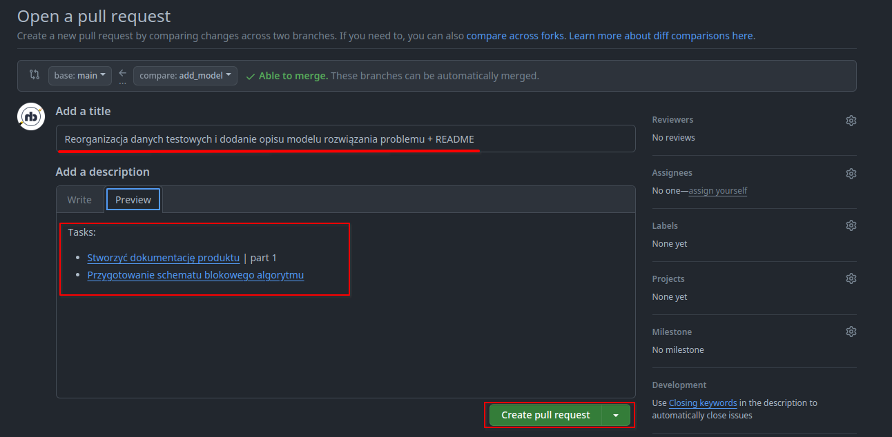
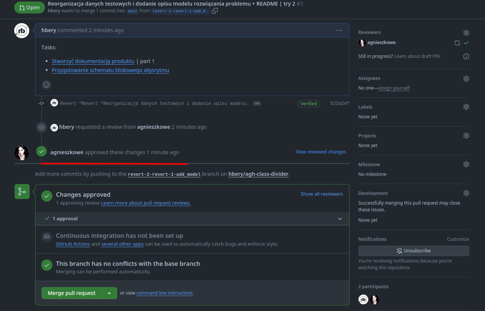
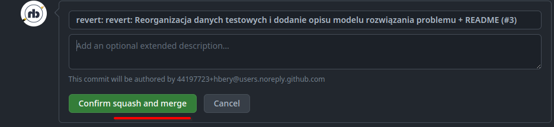

# Workflow w tym repozytorium

* Najpierw "zforkuj"



* Lokalnie zmień **remote**

```bash
git config --local user.name $your_gh_username
git config --local user.email $your_gh_email
```

> [!NOTE]
> Używaj kluczy SSH do logowania z gihubem - ułatwia to zadanie.
> [Tutaj](https://docs.github.com/en/authentication/connecting-to-github-with-ssh/generating-a-new-ssh-key-and-adding-it-to-the-ssh-agent) instrukcja

```bash
git remote rename origin upstream
git remote set-url upstream --push NO_PUSH
git remote add origin git@github.com:$your_username/agh-class-divider.git
```

* Potem stwórz branch do zmian

```bash
# inside git repo
git checkout -b $your_new_branch_name
```

* Wprowadź zmiany na branchu; dodaj je i "zacommituj"

```bash
git add $files..
git commit -am "$message"
git push origin $your_new_branch_name
```

* Pokaże Ci się link do utworzenia GitHub Pull Request.


* Otwórz go w przeglądarce, opisz zmiany jakie wprowadzasz i zaklikaj "Create Pull Request".


> [!NOTE]
> Aby zaakceptować PR wejdź w link PRa: https://.../pr/N/files
> i w prawym górnym rogu kliknij zielony przycisk "Review Changes" (możesz dodać tu komentarz do recenzji)
> i kliknij "Approve"

* Poczekaj na approve


* Zmerguj PR jako "Squash and Merge"

